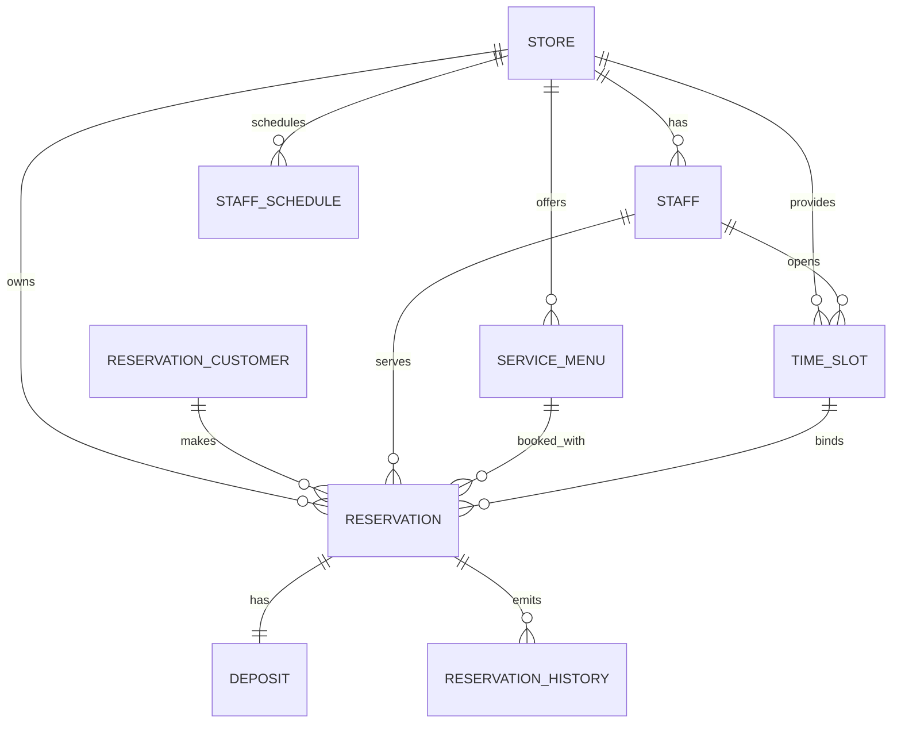

# ERD (Deposit 기반 예약 시스템)

## 전체 도메인 구조



---

# 1. Store

```sql
store
---------
store_id PK
name
status
timezone
created_at
updated_at
```

---

# 2. Staff

```sql
staff
---------
staff_id PK
store_id FK
name
role
status
created_at
updated_at
```

index

```text
idx_staff_store (store_id)
uq_staff_store_name (store_id, name)
```

---

# 3. ServiceMenu

```sql
service_menu
-------------
menu_id PK
store_id FK
name
duration_min
price
status
created_at
updated_at
```

---

# 4. ReservationCustomer

예약 고객

```sql
reservation_customer
--------------------
reservation_customer_id PK
name
phone
phone_hash
email
status
created_at
updated_at
```

status

```text
ACTIVE
BLOCKED
```

| 상태    | 의미                        |
| ------- | --------------------------- |
| ACTIVE  | 정상 고객                   |
| BLOCKED | 노쇼 반복 등으로 예약 차단  |

index

```text
uq_res_customer_phone_hash (phone_hash)
```

---

# 5. StaffSchedule

```sql
staff_schedule
---------------
schedule_id PK
store_id FK
staff_id FK
date
start_time
end_time
type
created_at
updated_at
```

type

```text
WORK
OFF
```

---

# 6. TimeSlot

슬롯 단위

```sql
time_slot
-----------
slot_id PK
store_id FK
staff_id FK
date
start_at
end_at
status
held_until
created_at
updated_at
```

status

```text
OPEN
BOOKED
BLOCKED
```

index

```text
idx_slot_store_date (store_id, date)
idx_slot_staff_start (staff_id, start_at)
idx_slot_store_staff_start (store_id, staff_id, start_at)
uq_slot_staff_start (staff_id, start_at)
```

---

# 7. Reservation

예약 핵심 테이블

```sql
reservation
-------------
reservation_id PK
store_id FK
reservation_customer_id FK
staff_id FK
menu_id FK
slot_id FK
customer_name
customer_phone_hash
start_at
end_at
status
cancel_reason
created_at
updated_at
```

status

```text
REQUESTED
CONFIRMED
COMPLETED
CANCELED
NO_SHOW
```

index

```text
idx_res_store_start (store_id, start_at)
idx_res_store_status_start (store_id, status, start_at)
idx_res_staff_start (staff_id, start_at)
idx_res_customer_phone (customer_phone_hash)
```

---

# 8. Deposit (예약금)

예약금 관리

```sql
deposit
--------
deposit_id PK
reservation_id FK
amount
currency
status
paid_at
refunded_at
forfeited_at
created_at
```

status

```text
PENDING
PAID
REFUNDED
FORFEITED
```

| 상태        | 의미     |
| --------- | ------ |
| PENDING   | 결제 대기  |
| PAID      | 결제 완료  |
| REFUNDED  | 환불 완료  |
| FORFEITED | 노쇼로 몰수 |

index

```text
idx_deposit_reservation (reservation_id)
uq_deposit_reservation (reservation_id)
```

---

# 9. ReservationHistory

감사 로그 (구 RESERVATION_EVENT)

```sql
reservation_history
-------------------
history_id PK (UUID)
store_id FK
reservation_id FK
event_type
occurred_at
actor_type
actor_id
payload_json
```

event_type

```text
RESERVATION_CREATED
RESERVATION_CONFIRMED
RESERVATION_CANCELED
RESERVATION_COMPLETED
RESERVATION_NO_SHOW
DEPOSIT_PAID
DEPOSIT_REFUNDED
DEPOSIT_FORFEITED
RESERVATION_PAYMENT_EXPIRED
```

index

```text
idx_history_store_time (store_id, occurred_at)
idx_history_res_time (reservation_id, occurred_at)
```

---

# 예약 상태 흐름

```text
예약 생성
↓
Reservation = REQUESTED
Deposit = PENDING
↓
예약금 결제
↓
Deposit = PAID
Reservation = CONFIRMED
↓
시술 완료
↓
Reservation = COMPLETED
```

---

# 취소 흐름

### 24시간 이전 취소 (환불)

```text
Reservation → CANCELED
Deposit → REFUNDED
Slot → OPEN
```

### 24시간 이내 취소 (몰수)

```text
Reservation → CANCELED
Deposit → FORFEITED
Slot → OPEN
```

---

# 노쇼 흐름

```text
Reservation → NO_SHOW
Deposit → FORFEITED
```

---

# 결제 타임아웃 흐름

```text
Deposit PENDING 10분 초과
↓
Reservation → CANCELED
Slot → OPEN
```

---

# 슬롯 점유

예약 생성 시

```text
OPEN → BOOKED
```

취소 / 타임아웃 시

```text
BOOKED → OPEN
```