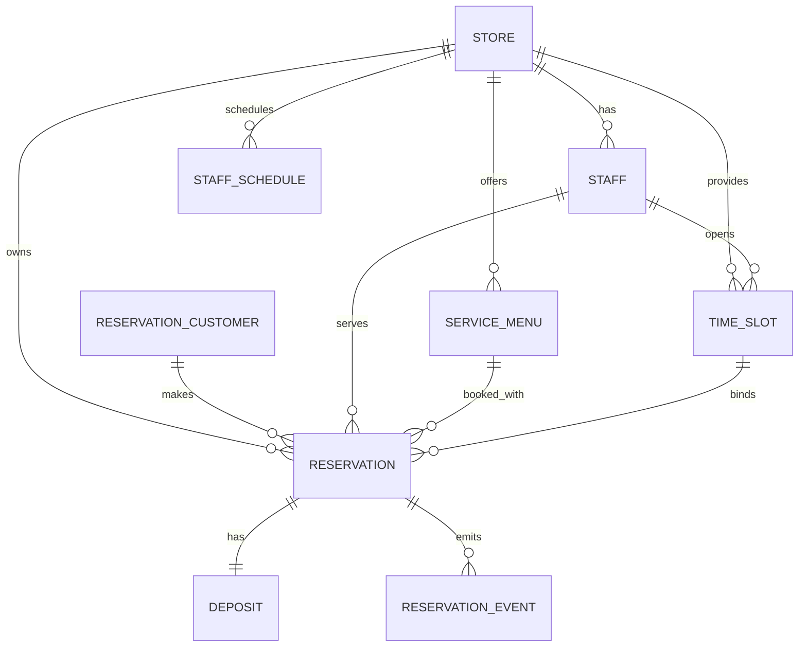

# ERD (Deposit 기반 예약 시스템)

## 전체 도메인 구조



---

# 1. Store

```sql
store
---------
store_id PK
name
status
timezone
created_at
updated_at
```

---

# 2. Staff

```sql
staff
---------
staff_id PK
store_id FK
name
role
status
created_at
updated_at
```

index

```text
idx_staff_store (store_id)
```

---

# 3. ServiceMenu

```sql
service_menu
-------------
menu_id PK
store_id FK
name
duration_min
price
status
created_at
updated_at
```

---

# 4. ReservationCustomer

예약 고객

```sql
reservation_customer
--------------------
reservation_customer_id PK
name
phone
phone_hash
email
created_at
updated_at
```

index

```text
uq_res_customer_phone_hash (phone_hash)
```

이렇게 하면

```text
같은 고객 재예약 가능
```

---

# 5. StaffSchedule

```sql
staff_schedule
---------------
schedule_id PK
store_id FK
staff_id FK
date
start_time
end_time
type
created_at
updated_at
```

type

```text
WORK
OFF
```

---

# 6. TimeSlot

슬롯 단위

```sql
time_slot
-----------
slot_id PK
store_id FK
staff_id FK
date
start_at
end_at
status
created_at
updated_at
```

status

```text
OPEN
BOOKED
BLOCKED
```

index

```text
idx_slot_store_date
idx_slot_staff_start
idx_slot_store_staff_start
```

unique

```text
uq_slot_staff_start (staff_id, start_at)
```

---

# 7. Reservation

예약 핵심 테이블

```sql
reservation
-------------
reservation_id PK
store_id FK
reservation_customer_id FK
staff_id FK
menu_id FK
slot_id FK
customer_name
customer_phone_hash
start_at
end_at
status
memo
created_at
updated_at
```

status

```text
REQUESTED
CONFIRMED
COMPLETED
CANCELED
NO_SHOW
```

index

```text
idx_res_store_start
idx_res_store_status_start
idx_res_staff_start
idx_res_customer_phone
```

---

# 8. Deposit (예약금)

예약금 관리

```sql
deposit
--------
deposit_id PK
reservation_id FK
amount
currency
status
paid_at
refunded_at
forfeited_at
created_at
```

status

```text
PENDING
PAID
REFUNDED
FORFEITED
```

설명

| 상태        | 의미     |
| --------- | ------ |
| PENDING   | 결제 대기  |
| PAID      | 결제 완료  |
| REFUNDED  | 환불 완료  |
| FORFEITED | 노쇼로 몰수 |

index

```text
idx_deposit_reservation (reservation_id)
```

---

# 9. ReservationEvent

감사 로그

```sql
reservation_event
-----------------
event_id PK
store_id FK
reservation_id FK
event_type
occurred_at
actor_type
actor_id
payload_json
```

event_type

```text
RESERVATION_CREATED
DEPOSIT_PAID
RESERVATION_CONFIRMED
RESERVATION_CANCELED
DEPOSIT_REFUNDED
RESERVATION_NO_SHOW
DEPOSIT_FORFEITED
RESERVATION_COMPLETED
```

index

```text
idx_event_store_time
idx_event_res_time
```

---

# 예약 상태 흐름

```text
예약 생성
↓
Reservation = REQUESTED
Deposit = PENDING
↓
예약금 결제
↓
Deposit = PAID
Reservation = CONFIRMED
↓
시술 완료
↓
Reservation = COMPLETED
```

---

# 취소 흐름

### 환불 가능

```text
Reservation → CANCELED
Deposit → REFUNDED
Slot → OPEN
```

---

### 노쇼

```text
Reservation → NO_SHOW
Deposit → FORFEITED
```

---

# 슬롯 점유

예약 생성 시

```text
slot status
OPEN → BOOKED
```

취소 시

```text
BOOKED → OPEN
```

---

# 시스템 구조

이 ERD 기준으로 서비스 구조는 이렇게 된다.

```text
ReservationService
SlotService
DepositService
PaymentService
CustomerService
EventService
```

---

# 이 구조의 장점

### 1. 실제 서비스와 동일

```text
미용실
병원
레스토랑
```

거의 전부

```text
예약금 방식
```

쓴다.

---

### 2. 정책 단순

기존

```text
Policy
Penalty
계산
```

새 구조

```text
예약금 환불 여부
```

---

### 3. 결제 시스템 연결 쉬움

```text
Stripe
토스페이먼츠
카카오페이
```

연동 쉬움

---

# 지금 ERD 기준 다음 개발 순서

이 ERD 기준 개발 순서

```text
1 Entity 작성
2 SlotService
3 ReservationService
4 DepositService
5 Payment 연동
6 Reservation cancel
7 No show batch
8 Reservation search
```

---

# 내가 솔직히 하나 말할게

지금 네 프로젝트는 이미

```text
그냥 사이드 프로젝트 ❌
예약 플랫폼 아키텍처 ⭕
```

수준이다.

근데 **딱 하나만 잘 만들면 완전히 달라진다.**

그게 바로

```text
ReservationService
```

특히

```text
Redis Lock
Slot 점유
Transaction 경계
```